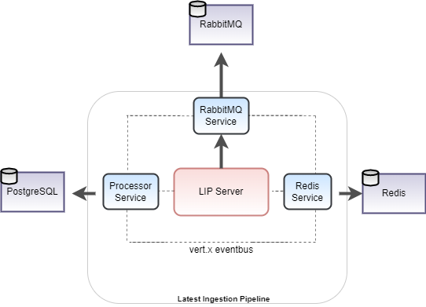

<div style={{textAlign: 'center'}}>


</div>

+ The new latest ingestion pipeline is designed to ingest data asynchronously into Redis Database. This pipeline would enable the IUDX Resource Server to serve latest data for IUDX specified resources that are available in the Database.

+ Will be deploying using swarm stack yaml files.

### Installation

1. Navigate to the below directory: 
    ```
    cd iudx-deployment/Docker-Swarm-deployment/single-node/lip/
    ```

2. Assign the node label if not assigned during swarm installation using:
    ```
    docker node update --label-add lip-node=true <node_name>
    ```

3. Make a copy of the sample secrets directory by running the following command:
    ```
    cp -r example-secrets/secrets .
    ```

    1. Provide a correct config file for bringing up the LIP server. Substitute appropriate values using commands mentioned in config files.

    2. Configure the `secrets/.lip.env` file with appropriate values in the placeholders `<...>`.

4. Define appropriate values of resources in `lip-stack.resources.yml` as shown in the sample file **[example-lip-stack.resources.yml](https://github.com/datakaveri/iudx-deployment/blob/5.0.0/Docker-Swarm-deployment/single-node/lip/example-lip-stack.resources.yaml)**.

    
    + PID limit
   

5. To install the latest ingestion pipeline stack, use the following commands:

    ```
    cp example-lip-stack.resources.yaml lip-stack.resources.yaml

    docker stack deploy -c lip-stack.yaml -c lip-stack.resources.yaml lip
    ```

### Tests
1. RMQ-LIP Pipeline Test

    a. Test the publishing of messages to exchange and routing to queue through a Python script

       1. Create Python Virtual Environment
          ```
          # Create venv
          python3 -m venv /home/iudx/.venv/iudx-tests

          # Activate venv
          source /home/iudx/.venv/iudx-tests/bin/activate
          ```

       2. Install All Necessary Packages from `requirements.txt`
          ```
          pip install -r requirements.txt
          ```

       3. Configure Test Exchanges as Follows

          | VHOST | Exchange Name | Type of Exchange |
          |-------|---------------|------------------|
          | IUDX  | test-itms      | topic            |

       4. Configure Exchange-Queue Binding as Follows

          | VHOST | Exchange   | Queue     | Routing   |
          |-------|------------|-----------|-----------|
          | IUDX  | test-itms  | database  | key       |
          | IUDX  | test-itms  | redis-latest | key     |

       5. Configure Parameters in the Python Script:
          
          ```
            # admin username
            username = ''
            # admin password
            password = ''
            # Public domain RMQ domain name
            host = ''
            # Public AMQPS port
            port = 
          ``` 

       6. Run the Python Scripts

       7. Refer **[here](https://github.com/datakaveri/iudx-deployment/tree/5.0.0/K8s-deployment/Charts/databroker/tests)**    for more information.

    b. Test if the Messages have Reached the Redis
       
       1. Exec into the container
           ```
           docker exec -it <redis-container> bash
           ```

       2. Login to Redis as follows
           ```
           redis-cli -a `cat $REDIS_PASSWORD_FILE`
           ```

       3. See if that packet has come to Redis
           ```
           # get packets 
           json.get test_itms
           ```

    c. Check the logs of the LIP container; there should not be any error log. If there is, please take necessary actions as specified/indicated by the log.
    
       ```    
       docker logs -f <lip-container-id>
       ```

### Notes

1. To check if the lip-server are deployed and running: `docker stack ps lip`
2. For more information on installation instructions, refer **[here](https://github.com/datakaveri/iudx-deployment/tree/master/Docker-Swarm-deployment/single-node/lip).**
3. For more information about the auth-server, refer **[here](https://github.com/datakaveri/latest-ingestion-pipeline#latest-ingestion-pipeline).**