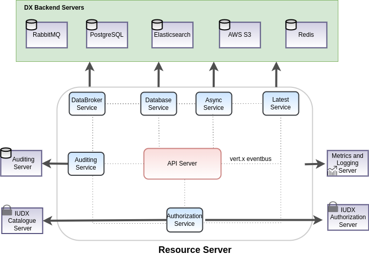

<div style={{textAlign: 'center'}}>

<br/>

</div>

+ The resource server is IUDXs data discovery, data publication and data subscription portal. It allows data providers to publish their data resources in accordance to the IUDX vocabulary annotated meta-data document, data subscribers to query and subscribe for data resources as per the consent of the provider. The consumers can access data from the resource server using HTTPs and AMQPs.

+ will be deployed using swarm stack YAML files.

### Installation

1. Navigate to the directory:
   
   ```
   cd iudx-deployment/Docker-Swarm-deployment/single-node/resource-server/
   ```

2. Assign the node label if not assigned during swarm installation using:

    ```
    docker node update --label-add rs-node=true <node_name>
    ```
 
3. Make a copy of the sample secrets directory by running the following command:

    ```
    cp -r example-secrets/secrets .
    ```

4. Provide a correct config file for bringing up resource-server. Substitute appropriate values using commands whatever mentioned in config files.

5. Configure the .rs.env file, refer to example-env

6. Define appropriate values of resources 

    + CPU requests and limits
    + RAM requests and limits
    + PID limit
    in `rs-stack.resources.yml` as shown in the sample file **[example-rs-stack.resources.yml](https://github.com/datakaveri/iudx-deployment/blob/4.5.0/Docker-Swarm-deployment/single-node/resource-server/example-rs-stack.resources.yaml)**.

7. To install catalogue server stack, use the following command:

    ```
    cp example-rs-stack.resources.yaml rs-stack.resources.yaml

    docker stack deploy -c rs-stack.yaml -c rs-stack.resources.yaml rs
    ```

### Notes

1. Resource-server api documentation can be accessed from **https://< cop-domain >/rs/apis**
2. To check if the resource-server are deployed and running: `docker stack ps rs`
3. For more information on installation instructions, refer **[here](https://github.com/datakaveri/iudx-deployment/tree/4.5.0/Docker-Swarm-deployment/single-node/resource-server#install)**.
4. For more information about the resource-server, refer **[here](https://github.com/datakaveri/iudx-deployment/tree/4.5.0/Docker-Swarm-deployment/single-node/resource-server#install)**.

