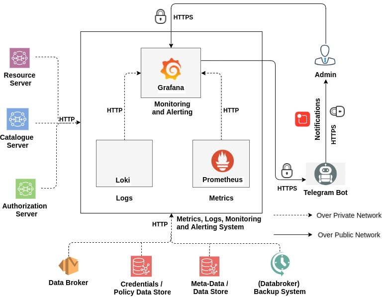

### Installation
<div style={{textAlign: 'center'}}>


</div>

1. Navigate to the below directory 
    ```
    cd iudx-deployment/Docker-Swarm-deployment/single-node/monitoring-stack/
    ```
2. Make a copy of sample secrets directory:

    ```
    cp -r example-secrets/secrets . 
    ```
3. Generate required secrets using following script:

    ```
    ./create_secrets.sh 
    ```
4. Make sure metrics targets directory on node where prometheus is deployed(should  be created by ansible script from provisioning node exporter , if not create it,  needs to be created with every restart, as its tmp directory )
    ```
    mkdir /tmp/metrics-targets 
    ```

5. Configure Telegrambot for grafana's alerts as detailed here. Then appropriately define the environment file secrets/.grafana.env(create grafana.env hidden file under secrets dir) The template is defined as follow: 

    <div class="boxBorder">
        GF_SERVER_ROOT_URL=https://grafana-domain-name/<br/>
        GF_SERVER_DOMAIN=grafana-domain-name<br/>
        TELEGRAM_CHAT_ID=telegram-chat-id<br/>
        TELEGRAM_BOT_TOKEN=telegram-chat-token
    </div>


:::note

**Please do not include comments and substitute appropriate correct values in the placeholders. If not be used as notifier, then add dummy values**
:::

****

6. Configure servers to be monitored for certificate expiry, server up status, as targets in blackbox-targets.yml. See below for an example.

<div class="center">
 - targets:<br/>
	&nbsp;&nbsp;&nbsp;&nbsp;- https://nec-cop.iudx.org.in/rs/apis<br/>
	&nbsp;&nbsp;&nbsp;&nbsp;- https://nec-cop.iudx.org.in/cat/apis/<br/>
    &nbsp;&nbsp;&nbsp;&nbsp;- https://nec-cop.iudx.org.in/auth/apis/
</div>

7. Define Appropriate values of resources in `mon-stack.resources.yaml` for grafana, prometheus, loki, promtail, blackbox as shown in sample resource-values file **[example-mon-stack.resources.yaml](https://github.com/datakaveri/iudx-deployment/blob/5.0.0/Docker-Swarm-deployment/single-node/monitoring-stack/example-mon-stack.resources.yaml)**

    + CPU requests and limits
    + RAM requests and limits
    + PID limit

    

8. Deploy Monitoring stack as follows: 

 ```
 ./install.sh
 ```
+ Grafana should now be available through nginx.
+ For more information on installation instructions, refer **[here](https://github.com/datakaveri/iudx-deployment/tree/5.0.0/Docker-Swarm-deployment/single-node/monitoring-stack)**

<details>
<summary><div class="test_color">Testing</div></summary>

+ To check if the mon-stack stacks are deployed and running: <br/>
```
 docker stack ps mon-stack
```
+ Access the **[Grafana web UI](https://logmanager-nec-cop.iudx.org.in)**

</details>


